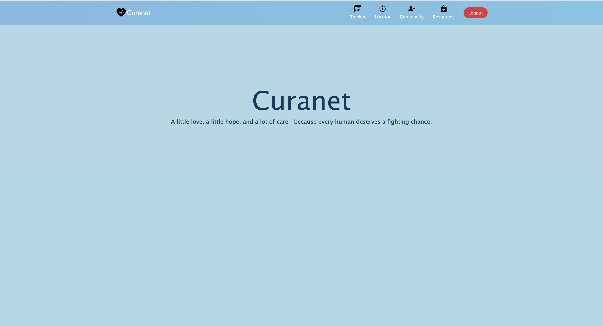
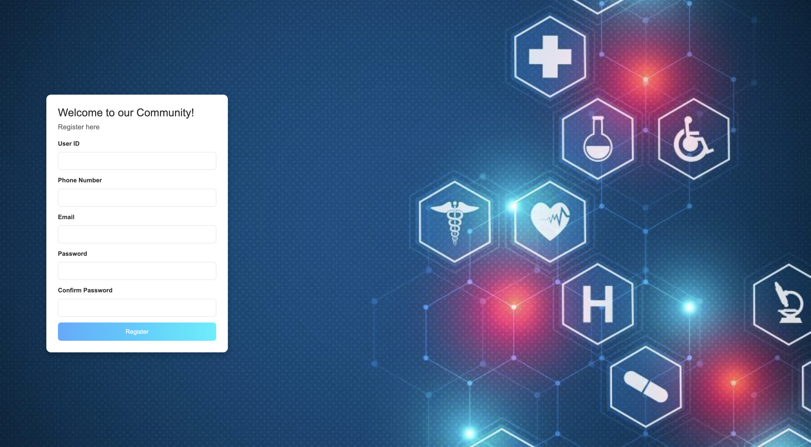
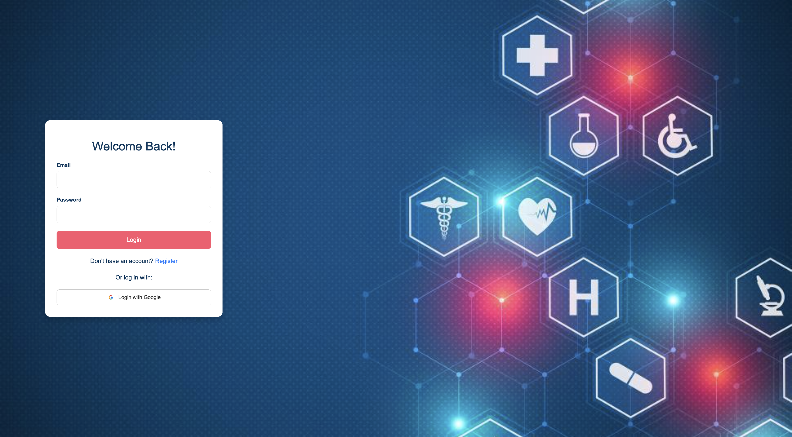
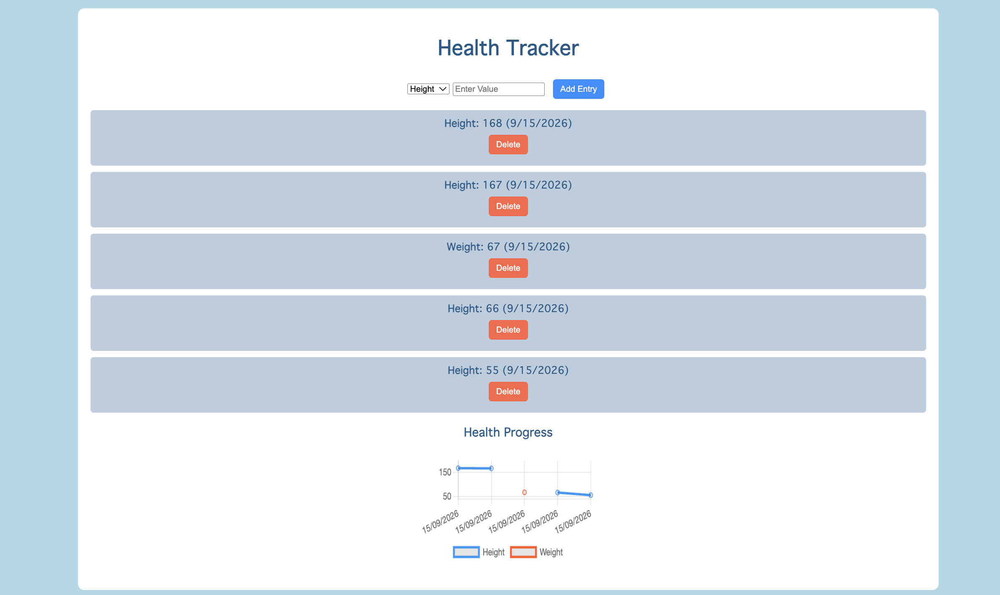
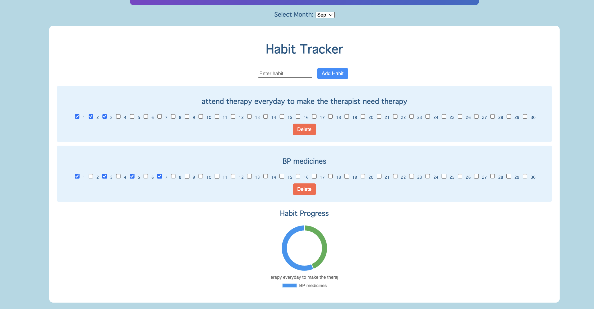
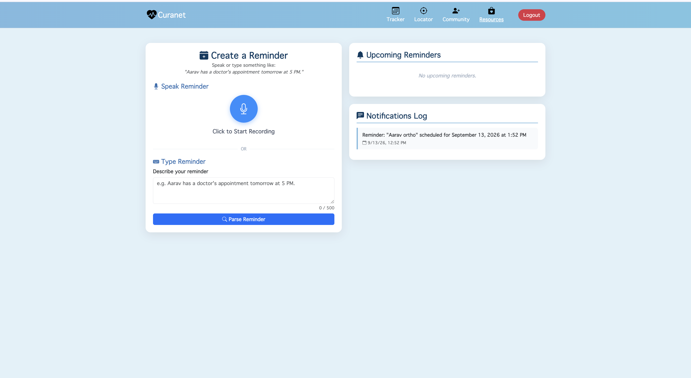
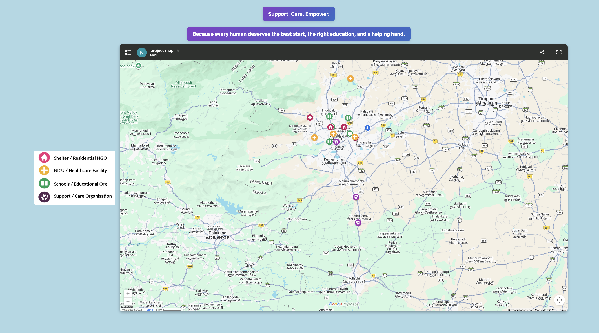
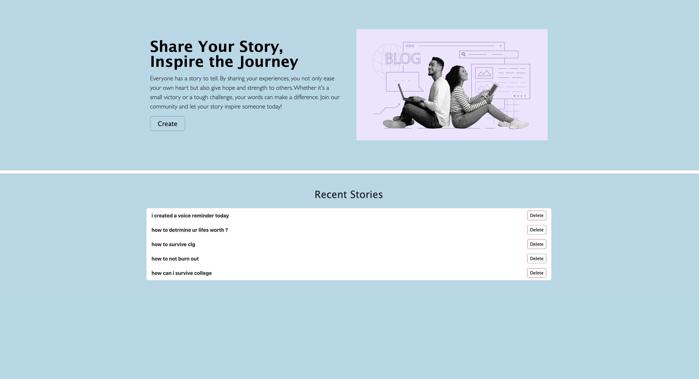

# Curanet - Healthcare Management Platform

Curanet is a web application designed to help caregivers track personal health vitals, manage daily habits, find nearby healthcare facilities, participate in community discussions, and schedule reminders with optional voice input and email alerts.

---

## Tech Stack

### **Backend & Architecture**
- **Node.js & Express.js**: REST routing, session management, and server-side request processing.
- **PostgreSQL (`pg`)**: Relational database for storing user accounts, metrics, habits, posts, and scheduled reminders.
- **Passport.js**: Authentication handling via local credentials (`bcrypt`) and Google OAuth 2.0 (`passport-google-oauth2`).
- **Node-Cron**: Automated background job scheduling for periodic reminder checks.
- **Resend API**: Email delivery service for sending reminder notifications.
- **Groq API / Whisper & Chrono-node**: Voice transcription (`multer` + speech-to-text) and natural language date/time parsing.

### **Frontend & UI**
- **EJS**: Server-side rendering of dynamic views and layouts.
- **CSS & HTML**: Custom responsive UI styling and layout design.
- **JavaScript (ES6+)**: Client-side audio recording (MediaStream Recording API), form validation, and interactive UI logic.
- **Google My Maps**: Embedded interactive map integration for locating nearby hospitals, clinics, and pharmacies.

---

## Application Preview & Pages

### 1. Landing / Home Page
> **Page**: `views/home.ejs`  
> **Description**: The primary entry point introducing the platform features with quick navigation to authentication, health tracking tools, and community sections.



---

### 2. User Registration
> **Page**: `views/register.ejs`  
> **Description**: Dedicated registration interface allowing new users to create accounts using standard credentials or sign in with Google.



---

### 3. User Login
> **Page**: `views/home.ejs` (Login view)  
> **Description**: Secure authentication form with email/password validation and Google OAuth single sign-on support.



---

### 4. Health Metrics Tracker
> **Page**: `views/tracker.ejs` (Health Tracker tab)  
> **Description**: Log and monitor essential health indicators such as blood pressure, heart rate, blood sugar, weight, and sleep hours over time.



---

### 5. Habit Tracker
> **Page**: `views/tracker.ejs` (Habit Tracker tab)  
> **Description**: Track daily lifestyle routines like water intake, exercise, medication adherence, and screen time to maintain healthy habits.



---

### 6. Voice & Reminders *(In Progress)*
> **Page**: `views/tracker.ejs` (Reminders section)  
> **Description**: *Currently under active development.* Set healthcare and medication reminders via text or voice recording, parsed into calendar dates with automated email dispatch via Resend.



---

### 7. Healthcare Facility Finder
> **Page**: `views/locator.ejs`  
> **Description**: Interactive map interface that uses geolocation to help users search for facilities and institutions.


---

### 8. Community Discussions
> **Page**: `views/community.ejs` & `views/open.ejs`  
> **Description**: A community discussion board where users can share , view and delete experiences for awareness.



---

## 🚀 Getting Started Locally

### Prerequisites
- [Node.js](https://nodejs.org/) (v16+ recommended)
- [PostgreSQL](https://www.postgresql.org/) database instance

### 1. Clone the repository
```bash
git clone <your-repository-url>
cd "Healthcare Project"
```

### 2. Install dependencies
```bash
npm install
```

### 3. Configure environment variables
Create a `.env` file in the project root:
```env
SESSION_SECRET=your_session_secret
PG_USER=your_postgres_user
PG_HOST=localhost
PG_DATABASE=your_database_name
PG_PASSWORD=your_postgres_password
PG_PORT=5432
GOOGLE_CLIENT_ID=your_google_client_id
GOOGLE_CLIENT_SECRET=your_google_client_secret
GROQ_API_KEY=your_groq_api_key
RESEND_API_KEY=your_resend_api_key
RESEND_FROM_EMAIL=onboarding@resend.dev
```

### 4. Database Setup
Initialize the database tables using the schema in `queries.sql`.

### 5. Run the application
```bash
# For development with nodemon
npm run dev

# Or for production
npm start
```

Access the application in your browser at `http://localhost:3000`.
